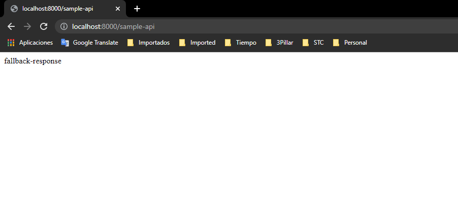

# currency-exchange-service
Currency Exchange Service, part of the microservices needed for the UDEMY course https://www.udemy.com/course/microservices-with-spring-boot-and-spring-cloud


# This microservices allows the user to indicate two currencies, a quantity and get the amount in the second currency

URL
http://localhost:8000/currency-exchange/from/USD/to/INR


Response Structure

```
{
    "id":10001,
    "from":"USD",
    "to":"INR",
    "conversionMultiple":65.00,
    "environment":"8000 instance-id"
}
```

#Load balancer


Running an instance over port 8001


#H2 DB Configurations and Console
spring.jpa.show = true
spring.datasource.url = jdbc:h2:mem:testdb
spring.h2.console.enabled = true
spring.jpa.defer-datasource-initialization = true  //Indicates that the application should look for a data.sql file after the schema.sql after the Schema creation 

url --> localhost:8000/h2-console


# How to Register a microservice in Eureka
- in the POM of the microservice project add the dependency for Eureka client
```
    <dependency>
        <groupId>org.springframework.cloud</groupId>
        <artifactId>spring-cloud-starter-netflix-eureka-client</artifactId>
    </dependency>
```
Additional, just to be sure, you can add the following to the properties file
``eureka.client.serviceUrl.defaultZone = http://localhost:8761/eureka``


#Client Side load balancing with Feign using spring-cloud-loadbalancer
- Is included in Eureka client dependency when you uses Feign Clients
- In old versions of Spring Cloud was called Ribbon
- The to implement it is removing the URL from the Feign
    - Then If there is more than one instance of the microservice running, the Spring Clouyd Load Balancer will check with Eureka the number of instances and will balance the load of requests.


# Spring Cloud Gateway to use the same common configuration between microservices
- In a typical Microservices architecture there are a lot of microservices (hundreds, thousands)
- A lot of them share common configurations
- Spring Cloud API Gateway does that work for you
  - In Earlier versions of Spring was called Zuul


# Spring Cloud Gateway to use the same common configuration between microservices
- In a typical Microservices architecture there are a lot of microservices (hundreds, thousands)
- A lot of them share common configurations
- Spring Cloud API Gateway does that work for you
  - In Earlier versions of Spring was called Zuul

Is registered automatically in Eureka, but to be sure, you can configure the properties file
``eureka.client.serviceUrl.defaultZone = http://localhost:8761/eureka``

# Enable the ability to discover microservices talking with EUREKA and using the name convention in Eureka http://localhost:8761 (e.g) CURRENCY-EXCHANGE
```spring.cloud.gateway.discovery.locator.enabled = true```

Allows to talk With Eureka and use the name of the application to go to the service through the name registered
e.g

```
  Original URL  
  http://localhost:8100/currency-conversion-feign/from/USD/to/MXN/quantity/10

  Using Spring Gateway 
  http://localhost:8765/CURRENCY-EXCHANGE/currency-exchange/from/USD/to/MXN

```

To avoid the upper case in the url add the following to properties

``spring.cloud.gateway.discovery.locator.lowerCaseServiceId = true``

Then...
```
  Original URL
  http://localhost:8100/currency-conversion-feign/from/USD/to/MXN/quantity/10
  
  Using Spring Gateway 
  http://localhost:8765/currency-exchange/currency-exchange/from/USD/to/MXN
```


# Circuit Breaker using Resilience4j (Earlier Hystrix)


- Inspired in Netflix Hystrix
- Review Resilience4j site to check if the followind dependencies are the only ones that we need to add:
  - actuator
  - spring boot2
  - spring aop

```
  		<dependency>
			<groupId>org.springframework.boot</groupId>
			<artifactId>spring-boot-starter-actuator</artifactId>
		</dependency>
		
		<dependency>
			<groupId>org.springframework.boot</groupId>
			<artifactId>spring-boot-starter-aop</artifactId>
		</dependency>

		<dependency>
			<groupId>io.github.resilience4j</groupId>
			<artifactId>resilience4j-spring-boot2</artifactId>
		</dependency>
        
```

# Some configurations for Circuit Breaker
@Retry(name = "default") --> Added in a method in the Controller 
This tries 3 times before return an error.

- You can customize your own retries configuration
  @Retry(name = "sample-api") --> Choose the name

Then in the properties file...
``resilience4j.retry.instances.sample-api.maxRetryAttempts = 5``


Configuring default response
@Retry(name = "sample-api", fallbackMethod = "hardcodedResponse")
Then you need to created a method with the name "hardcodedResponse"

```
public String hardcodedResponse(Exception ex){
  return "fallback-response";
}
```



Configuring time to wait between each try
``resilience4j.retry.instances.sample-api.waitDuration = 1s``

Configuring exponential time between each try
``resilience4j.retry.instances.sample-api.enableExponentialBackoff = true``


Using @CircuitBreaker annnotation
@CircuitBreaker(name = "default", fallbackMethod = "hardcodedResponse")

Will break the circuit and return a response back

How to send a lot of request from terminal to simulate 100 or 200  request to an endpoint?
10 request Per second (Requires install cURL in Windows)
``watch -n 0.1 curl http://localhost:8000/sample-api``

# How Circuit Breaker Works
States

CLOSED --> Always calling the dependant microservice constantly
OPEN --> Will return directly the fallback response
HALF_OPEN --> Will send a portion of request to the microservice and the rest to fallback response

You can configure a rate to determine when a microservice is down and moved to OPEN status.
(Look Resilience4j Documentation -> Spring Boot 2)

#Ratelimit and BulkHead features
@RateLimiter(name="default") // in 10s i want only allow 2 calls
@Bulkhead(name = "default")


In the properties file...
```
resilience4j.ratelimiter.instances.default.limitForPeriod = 2
resilience4j.ratelimiter.instances.default.limitRefreshPeriod = 10s
```

How many simultaneous calls? this is BulkHead
``resilience4j.bulkhead.instances.default.maxConcurrentCalls = 10``


# Distributed Tracing (Zipkin Server)
- ¿How you can trace a request tha travels across a lot of Microservices?
  - Using Distributed Tracing 


